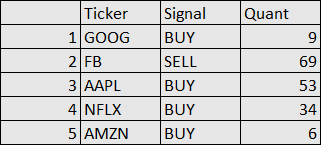

# Interactive Broker API Order Placing Example in Python
 
## Create a simple trading strategy for the FAANG stocks and use IB API to place orders into the IB platform. 

#### author: Yi Rong
#### update on 12/30/20

---

### 1. Create a Trading Strategy and Generate Signal Sheet for Placing Orders

* Target: "GOOG","FB","AAPL","NFLX","AMZN"

* Buy $10,000 if ma50>ma200 

* Sell $10,000 if ma50<ma200 

Signal Sheet is generated as below:



### 2. Placing Orders through IB API in Python

#### Usage

```python
import pandas as pd
import random
from ib.ext.Contract import Contract
from ib.ext.Order import Order
from ib.opt import Connection, message
import time

def error_handler(msg):
    print ("Server Error: %s" % msg)

def reply_handler(msg):
    print ("Server Response: %s, %s" % (msg.typeName, msg))

def create_contract(symbol, sec_type, exch, prim_exch, curr):
    contract = Contract()
    contract.m_symbol = symbol
    contract.m_secType = sec_type
    contract.m_exchange = exch
    contract.m_primaryExch = prim_exch
    contract.m_currency = curr
    return contract

def create_order(order_type, quantity, action, account):
    order = Order()
    order.m_orderType = order_type
    order.m_totalQuantity = quantity
    order.m_action = action
    order.m_account = account
    return order
cli=random.randint(1,1000000000)
```
```python
# order details calculated by historical data
order_info=pd.read_csv('Signals.csv', encoding = 'utf8')

# place order to a account
if __name__ == "__main__":
    Order_list=order_info['Ticker']
    Action_List=order_info['Signal']
    Quantity_List=order_info['Quant']
    
    for i in range(5):
        tws_conn = Connection.create(port=7497, clientId=cli)
        
        tws_conn.connect()

        tws_conn.register(error_handler, 'Error')

        tws_conn.registerAll(reply_handler)

        order_id = 200
    
        get_contract = create_contract(Order_list[i], 'STK', 'SMART', 'SMART', 'USD')
        
        get_order = create_order('MKT', int(Quantity_List[i]), Action_List[i], 'DU1266736')

        tws_conn.placeOrder(order_id, get_contract, get_order)

        time.sleep(1)

        tws_conn.disconnect()
        cli=cli+1
```

#### Order Placed


#### Order Executed

